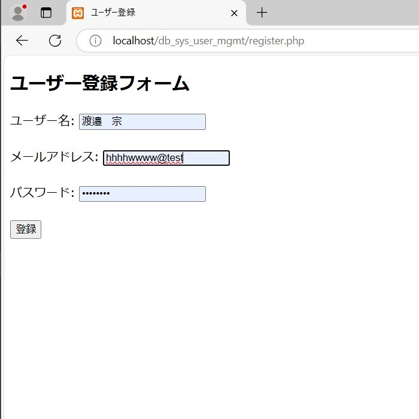

# クライアント管理システム構築デモ（Windows Server + Apache + PHP/MySQL + AD DS）

このリポジトリは、**Windows Server 環境と LAMP 構成を用いた社内クライアント管理業務の技術デモ**です。  
ITインフラの構築・ユーザーアカウント管理・Webフォーム運用のスキルを総合的に示すことを目的に、応募用ポートフォリオとして構成しています。

---

## 📌 本デモの構成概要

- 仮想環境（Hyper-V）上に Windows Server 2022 を構築
- Active Directory によるユーザー管理とグループポリシー（GPO）運用
- Apache + PHP + MariaDB による社内向けWebフォームを実装
- GitHub 上で構成・コード・構成図・画面キャプチャの履歴を公開

---

## 🖼️ システム構成図（3層アーキテクチャ）

本デモでは、以下のような3層構造でシステムを構築しています：

  

- **プレゼンテーション層（ユーザー操作）**：Webブラウザでフォーム入力を行うユーザー
- **アプリケーション層（PHP処理）**：Apache上で動作するPHPスクリプト
- **データ層（データ保存）**：MariaDBがユーザー情報を管理

---

## ⚙️ 使用技術・システム構成

| コンポーネント | 内容 |
|----------------|------|
| OS | Windows Server 2022 |
| Webサーバー | Apache 2.4.58（XAMPP） |
| PHP | 8.2.12 |
| DB | MariaDB 10.4.32（MySQL互換） |
| その他 | Active Directory（AD DS）、PowerShell、Git |

---

## 📁 ディレクトリ構成

| ディレクトリ | 内容 |
|--------------|------|
| `user-portal/` | ユーザー向けPHPフォーム（`register`, `submit`, `list`） |
| `server-config/` | Apache/PHP/MySQL設定用ファイル |
| `ad-config/` | ADユーザー/GPO設定用のPowerShellスクリプト |
| `docs/` | スクリーンショット・構成図などの資料 |
| `operations-log.md` | 手順や補足メモを記録 |
| `.gitignore` | Gitの対象外ファイル指定 |

---

## 🖥️ 画面キャプチャ

| 項目 | サムネイル | 説明 |
|------|------------|------|
| 登録フォーム |  | ユーザー情報を入力する画面 |
| 登録処理結果 |  | 登録完了後の画面またはリスト反映 |
| 一覧画面 |  | 登録済みユーザーを一覧表示 |

---

## ✅ 機能確認内容

- `phpinfo()` による Apache/PHP の動作確認
- `register.php` → DB登録 → `list.php` で一覧表示まで確認済み
- AD配下のクライアントPCからのドメインログオン成功を確認済み

---

## ▶️ 実行・確認方法（概要）

1. `register.php` にアクセスし、ユーザー情報を入力  
2. `register_submit.php` がデータベースに情報を登録  
3. `list.php` で登録済みユーザーが一覧表示される

※使用DBは `userdb.users`、テーブル構成は `server-config/mysql-init.sql` に記載予定

---

## 📎 補足・備考

- 本システムはローカルの XAMPP 環境を前提としています
- 応募用に最小限の機能を再現し、インフラ運用・システム管理の経験を証明する構成としています

---

## 🗂️ ライセンス・利用

本リポジトリは個人ポートフォリオとして公開しており、商用利用を除き再利用・改変は自由です。
